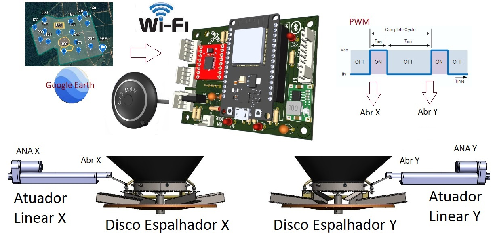
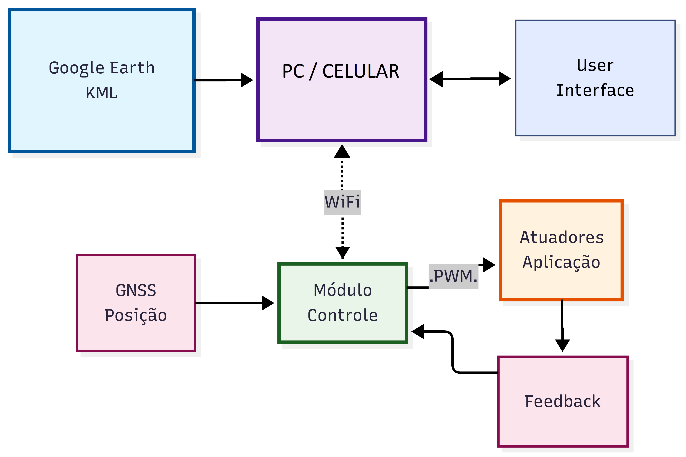
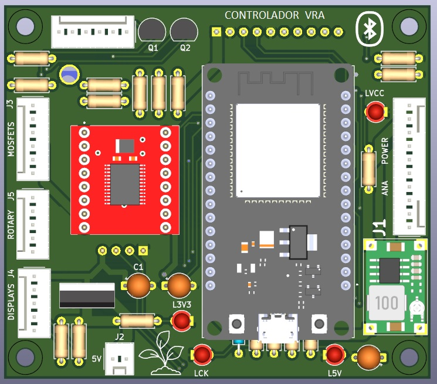
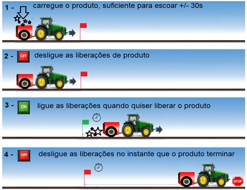

# VRA_Controlador

[](https://doi.org/10.5281/zenodo.19951135)
[](LICENSE)
[](https://www.espressif.com/en/products/socs/esp32)

Implementação em ESP32 do controlador de Aplicação em Taxa Variável (VRA) descrito no artigo apresentado no SBIAGRO 2025 ([PDF](docs/SBIAGRO2025_artigo.pdf), [slides](docs/SBIAGRO2025_apresentacao.pdf)). Lê zonas de manejo em arquivo KML do Google Earth, executa a Lógica Hierárquica de seleção de dose e aciona um atuador linear via controle PID.

Trabalho de pesquisa de Edson Casagrande no programa de pós-graduação em Engenharia de Computação da Escola Politécnica da USP (POLI/USP), sob orientação do Prof. Carlos Eduardo Cugnasca.



## Arquitetura



## Pré-requisitos

- ESP32 DevKit V1 (board `esp32doit-devkit-v1`)
- [PlatformIO](https://platformio.org/) (extensão VSCode ou CLI)
- Cabo USB

## Instalação

```bash
git clone https://github.com/edcasag/VRA_Controlador.git
cd VRA_Controlador
pio run
pio run -t upload
pio run -t uploadfs
pio device monitor
```

## Modos de build

Selecionados em `platformio.ini` via `-DBUILD_X`:

| Modo | Hardware adicional | Descrição |
|---|---|---|
| `BUILD_SIM` (default) | nenhum | Simulação completa standalone com GPS sintético e atuador simulado |
| `BUILD_ANALISE` | nenhum | Análise do KML carregado e cenários do Algoritmo 1 |
| `BUILD_TESTS` | nenhum | 9 testes automatizados |
| `BUILD_POC` | GPS, atuador, botões | POC completo com FreeRTOS |

Procedimento detalhado em [docs/README.md](docs/README.md).

## KMLs incluídos

| Arquivo | Conteúdo |
|---|---|
| `data/ensaio_abcd.kml` | 4 zonas A/B/C/D (1 ha cada, 90/75/60/100 kg/ha) |
| `data/talhao_completo.kml` | 7 zonas (50–100 kg/ha) |
| `data/Sitio_Palmar.kml` | Talhão real (14 vértices, 6 inclusões, 1 exclusão, 7 amostras IDW) |

Convenção dos nomes (campo `<name>` da Placemark KML):

| Sintaxe | Significado |
|---|---|
| `Field=0` ou nome qualquer | Polígono do talhão |
| `Label=Rate` (ex.: `Good=100`) | Polígono de inclusão |
| `Label=0` ou apenas `0` | Polígono de exclusão |
| `Label=Rate:Radius` (ex.: `Pedra=0:5m`) | Círculo de exclusão |
| Número (ex.: `120`) | Ponto de amostra IDW |

Quando duas zonas de inclusão se sobrepõem, vence a de menor área.

## Hardware (modo BUILD_POC)

PCB do controlador (placa EC-1.0):



Esquemático completo: [images/esquema_prototipo.jpg](images/esquema_prototipo.jpg).

Montagem física para calibração (`m c1`/`m c2`/`m c3`):



## Validação

Validação cruzada entre o controlador e o simulador Python documentada em [docs/cross_validation_python_vs_esp32.md](docs/cross_validation_python_vs_esp32.md). Capturas de saída de cada modo em [docs/](docs/).

## Como citar

Software (Concept DOI, aponta para a última versão):

```text
Casagrande, E. (2026). VRA_Controlador. Zenodo.
https://doi.org/10.5281/zenodo.19951135
```

```bibtex
@software{casagrande2026vracontrolador,
  author    = {Casagrande, Edson},
  title     = {{VRA\_Controlador}},
  year      = 2026,
  publisher = {Zenodo},
  doi       = {10.5281/zenodo.19951135},
  url       = {https://doi.org/10.5281/zenodo.19951135}
}
```

Artigo correspondente (SBIAGRO 2025):

```bibtex
@inproceedings{casagrande2025sbiagro,
  author    = {Casagrande, Edson and Cugnasca, Carlos Eduardo},
  title     = {Controlador de Taxa Vari{\'a}vel para Distribuidores Agr{\'i}colas
               baseado em Google Earth e Interpola{\c{c}}{\~a}o IDW},
  booktitle = {Anais do XV Congresso Brasileiro de Agroinform{\'a}tica (SBIAGRO 2025)},
  year      = {2025}
}
```

## Licença

[MIT](LICENSE).

Bibliotecas vendored: [tinyxml2](https://github.com/leethomason/tinyxml2) (licença zlib).

## Software relacionado

[VRA_Simulador](https://github.com/edcasag/VRA_Simulador) — simulador em Python (DOI [10.5281/zenodo.19952166](https://doi.org/10.5281/zenodo.19952166)).

---

## English

ESP32 implementation of the Variable-Rate Application (VRA) controller described in the SBIAGRO 2025 paper. Reads management zones from a Google Earth KML, executes the Hierarchical Logic for dose selection, and drives a linear actuator via PID control.

Research work by Edson Casagrande at the Polytechnic School of the University of São Paulo (POLI/USP), under Prof. Carlos Eduardo Cugnasca.

### Quick install

```bash
git clone https://github.com/edcasag/VRA_Controlador.git
cd VRA_Controlador
pio run
pio run -t upload
pio run -t uploadfs
pio device monitor
```

### License

[MIT](LICENSE).
